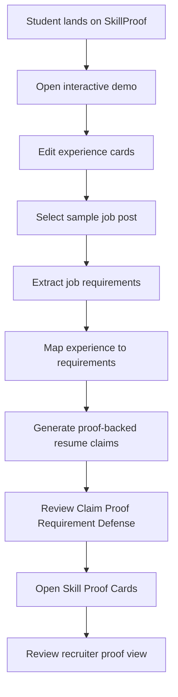
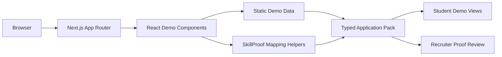

# SkillProof

SkillProof is a proof-backed application demo for the Talentbank Tech Hackathon 2026.

It helps students turn vague coursework, part-time work, and club experience into defensible resume claims by showing the proof and employer requirement behind every bullet.

## Story Scenario

A Malaysian final-year student is applying for internships and graduate roles. Their resume says things like:

- "Did group assignment about GrabFood."
- "Helped with club event."
- "Worked part-time at cafe."

Those lines look weak, but the student may actually have evidence of customer research, coordination, communication, presentation, or basic analysis. SkillProof helps the student translate that messy experience into role-specific resume claims, then shows what each claim is based on and how the student should defend it in an interview.

## Problem Statement

Students do not always lack experience. They often lack the language and proof structure to show how their experience maps to what employers ask for.

Most resume tools polish wording, optimize for ATS keywords, or generate generic career advice. SkillProof is narrower: every generated claim must connect to a source experience, a matched job requirement, and a defense question.

## Solution

SkillProof turns student experience into a proof chain:

```text
Claim -> Proof -> Requirement -> Defense
```

The demo lets a student:

- Edit seeded experience cards from coursework, part-time work, and club activity.
- Select a sample job post such as Marketing Intern, Business Analyst Intern, or Management Trainee.
- See requirement coverage with careful labels: Direct match, Possible match, Needs detail, and Not shown.
- Review proof-backed resume bullets.
- Open Skill Proof Cards that link a skill claim to its source evidence and interview question.
- Inspect a recruiter-facing proof review with no ATS score, no ranking, and no hiring recommendation.

## Product Concept

SkillProof is not a generic AI resume builder. It is a claim-proof system for early talent.

Core ideas:

- **Living Portfolio**: student experiences become reusable evidence cards.
- **Adaptive Readiness Profile**: role coverage is shown with careful status labels, not fake percentages.
- **Employer-Language Translator**: job requirements are mapped to student evidence and resume language.
- **Switch Lens**: the same experience can be reframed for different roles.

The V1 demo is an interactive mock. It uses static seeded data and deterministic TypeScript helpers instead of real AI, backend APIs, or a database.

## User Flow



## System Architecture Flow



## Tech Stack

| Area | Technology |
| --- | --- |
| Frontend | Next.js 14, React 18, TypeScript |
| Styling | Tailwind CSS |
| Icons | lucide-react |
| Data | Static seeded TypeScript data |
| Backend | None in V1 |
| Database | None in V1 |
| AI / APIs | None in V1 |
| Tooling | ESLint, PostCSS, npm |

## Smart Contracts

This project does not use smart contracts.

## Getting Started

Install dependencies:

```bash
npm install
```

## Environment Variables

No environment variables are required for the current static demo.

## Running Locally

Start the development server:

```bash
npm run dev
```

Then open:

```text
http://localhost:3000
```

Useful commands:

```bash
npm run lint
npm run build
npm run start
```

## Project Structure

```text
src/
  app/
    page.tsx              Landing page and product story
    demo/page.tsx         Interactive demo route
    globals.css           Global Tailwind styles
  components/
    SkillProofDemo.tsx    Main interactive demo
    ui.tsx                Shared UI primitives
  lib/
    demoData.ts           Seeded experiences, jobs, and outputs
    skillproof.ts         Static mapping and lookup helpers
  types/
    skillproof.ts         Shared product types
PLAN.md                   Product and implementation plan
RULES.md                  Hackathon requirements and module notes
```

## Demo / Screenshots

The app currently includes:

- A product landing page at `/`.
- An interactive mock demo at `/demo`.
- Seeded student experience cards.
- Sample job posts.
- Claim proof chains.
- Skill Proof Cards.
- Recruiter Proof Review.

Add deployed demo and screenshots here after hosting.

## Roadmap

- Improve the visual polish and responsive behavior of the demo.
- Add stronger sample data for more Malaysian student scenarios.
- Make Switch Lens more prominent across multiple roles.
- Add optional export-ready resume sections.
- Replace static mapping helpers with real AI parsing only after the proof-chain workflow is validated.

## Notes

SkillProof is scoped as a hackathon demo and Career OS module concept. It intentionally avoids ATS scoring, job marketplace behavior, talent matching, fake readiness percentages, and hiring recommendations.

